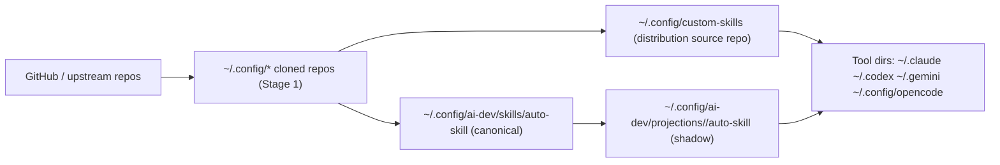
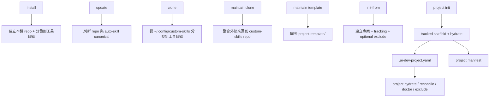

# ai-dev 指令與資料流參考

本文件描述 `ai-dev` 目前已實作的命令面、核心副作用、狀態檔與主要資料流。

目標讀者：
- 使用 `ai-dev` 的一般使用者
- 維護 `custom-skills` repo 的開發者
- 需要判斷某個指令會改哪些檔案、讀哪些 state 的人

本文描述的是「目前實作行為」，不是規劃稿。CLI 細節選項仍以 `ai-dev --help` 與各子命令 `--help` 為準。

## 命令分層

| 分類 | 命令 | 作用 |
|------|------|------|
| 環境安裝與分發 | `install`, `update`, `clone`, `status`, `list`, `toggle` | 安裝工具、更新倉庫、分發資源、檢查與切換資源狀態 |
| Repo 註冊 | `add-repo`, `add-custom-repo`, `update-custom-repo` | 管理上游 repo 與自訂 repo |
| 專案模板與投影 | `init-from`, `project init`, `project hydrate`, `project reconcile`, `project doctor`, `project update`, `project exclude` | 初始化專案、投影 AI 檔、檢查與維護專案內狀態 |
| custom-skills 自維護 | `maintain clone`, `maintain template` | 維護 `custom-skills` repo 本身 |
| 標準體系 | `standards status/list/switch/show/overlaps/sync` | 管理 `.standards/` profiles 與重疊檢測 |
| 同步與記憶 | `sync init/push/pull/status/add/remove`, `mem register/push/pull/status/cleanup/reindex/auto` | 跨裝置同步設定與 claude-mem 同步 |
| 輔助工具 | `test`, `coverage`, `derive-tests`, `hooks install/uninstall/status`, `tui` | 測試、覆蓋率、衍生測試、Hooks、互動介面 |

## 重要狀態檔

| 路徑 | 用途 | 主要寫入者 |
|------|------|------------|
| `~/.config/custom-skills/` | 已安裝的 `custom-skills` 本機 repo，也是 Stage 3 分發來源 | `install`, `update` |
| `~/.config/custom-skills/disabled/` | 被停用後暫存的資源目錄 | `toggle`, `standards sync`, `standards switch` |
| `~/.config/custom-skills/toggle-config.yaml` | toggle 資源開關狀態 | `toggle` |
| `~/.config/ai-dev/repos.yaml` | 上游 repo / custom repo / template repo 註冊表 | `add-repo`, `add-custom-repo`, `update-custom-repo`, `init-from` |
| `~/.config/ai-dev/skills/auto-skill` | `auto-skill` canonical state | `install`, `update`, `clone`, `maintain clone` |
| `~/.config/ai-dev/projections/<target>/auto-skill` | 各 target 的 `auto-skill` shadow state | `install`, `clone` |
| `~/.config/ai-dev/manifests/projects/<project_id>.yaml` | 專案 AI projection manifest | `init-from`, `project init`, `project hydrate`, `project reconcile` |
| `<project>/.ai-dev-project.yaml` | 專案 intent、managed files、git exclude 設定 | `init-from`, `project init`, `project exclude`, `project hydrate` |
| `<project>/.git/info/exclude` | 本地 git 排除規則 | `init-from`, `project init`, `project hydrate`, `project reconcile`, `project exclude` |
| `<project>/openspec/project.md`、`<project>/openspec/config.yaml` | OpenSpec 專案初始化狀態 | `openspec init` |
| `<project>/.standards/manifest.json` | UDS scaffold manifest | `project init`, `init-from` |
| `<project>/.claude/disabled.yaml` | standards profile 停用清單 | `standards switch` |
| `<project>/.standards/active-profile.yaml` | 目前啟用的 standards profile | `uds init`, `standards switch` |
| `<project>/.standards/profiles/overlaps.yaml` | standards 重疊定義 | repo tracked scaffold / 模板內容 |
| `~/.config/ai-dev/sync.yaml` | sync 子系統設定 | `sync init`, `sync add`, `sync remove`, `sync push`, `sync pull` |
| `~/.config/ai-dev/sync-repo/` | sync 使用的本地 Git repo | `sync init`, `sync push`, `sync pull` |
| `~/.config/ai-dev/sync-server.yaml` | mem sync server 設定 | `mem register`, `mem auto` |
| `~/.config/ai-dev/pulled-hashes.txt` | mem pull 去重紀錄 | `mem pull` |
| `~/.claude-mem/claude-mem.db` | 本地 claude-mem SQLite 資料庫 | claude-mem worker / `mem pull` fallback import |
| `project-template.manifest.yaml` | `project-template/` allowlist manifest | repo 維護者手動維護 |

## 核心資料流

### 1. 環境層：安裝、更新、分發

| 命令 | 主要副作用 |
|------|------------|
| `ai-dev install` | 建立本機 repo 與工具環境，刷新 `auto-skill` canonical state，並從 `~/.config/custom-skills` 分發到各工具目錄 |
| `ai-dev update` | 更新工具與本機 repo，刷新 `auto-skill` canonical state，不直接動 target shadow |
| `ai-dev clone` | 從 `~/.config/custom-skills` 分發資源到各工具目錄，並更新各 target 的 `auto-skill` shadow |

### 2. 專案層：built-in project-template

`project init` 採用兩段式流程：

1. 複製 tracked scaffold。
2. 執行 hydrate projection，把 AI 管理檔案投影到專案內。

其中：
- tracked scaffold 例如 `.standards/`、`.editorconfig`、`.gitattributes`、`.gitignore`
- AI projection 例如 `.claude/`、`.codex/`、`.gemini/`、`.opencode/`、`AGENTS.md`、`CLAUDE.md`

AI projection 依型態再分三類：
- `managed_block`：`AGENTS.md`、`CLAUDE.md`、`GEMINI.md`、`INSTRUCTIONS.md`。只在檔案最上方插入或更新 ai-dev 管理區塊，檔案其他內容保留。
- `dir`：`.claude/`、`.codex/`、`.gemini/`、`.opencode/`、`.agent/`、`.agents/`、`.github/skills/`、`.github/prompts/` 等投影目錄。
- `file`：例如 `.github/copilot-instructions.md` 這類單檔投影。

### 3. 專案層：外部模板 repo

`init-from` 的語意是：
- 從外部模板 repo 初始化專案
- 建立 `.ai-dev-project.yaml`
- 視使用者選擇決定是否啟用 `.git/info/exclude`

`project init` 的語意是：
- 從內建 `project-template/` 初始化專案
- 同樣在 git repo 內詢問是否啟用 `.git/info/exclude`

這兩條路現在在「是否啟用本地排除」上應保持一致。

## `project` 子系統詳細行為

### `ai-dev project init`

作用：
- 建立 `.ai-dev-project.yaml`
- 複製 tracked scaffold
- 將 AI 管理檔交給 hydrate 投影

注意：
- `project init` 會放入 `.standards/` scaffold，但不會替外部 `uds` CLI 完成 `uds init`

衝突規則：
- 同名檔案：`init` 走內容級別分析；`init --force` 直接覆蓋檔案
- 同名目錄：遞迴到檔案層級處理；模板有對應檔案才比對與處理，目標額外檔案保留
- AI 管理檔：不在第一段直接 copy，而交給 hydrate

git exclude 規則：
- 若目標目錄已有 `.git/`，會詢問是否把 AI 生成檔加入 `.git/info/exclude`
- 若使用者選擇 `yes`，`git_exclude.enabled=true`
- 若使用者選擇 `no`，只記錄設定，不寫 `.git/info/exclude`
- 若目標目錄尚未 `git init`，只顯示提示，並將 `git_exclude.enabled=false`

### `ai-dev project hydrate`

作用：
- 依 `.ai-dev-project.yaml` 與 `project-template/` 重新生成 AI 管理檔
- 更新專案 projection manifest

exclude 規則：
- 只在 `.ai-dev-project.yaml` 的 `git_exclude.enabled=true` 時同步 `.git/info/exclude`
- 若 `enabled=false`，不會偷偷幫使用者開啟本地排除

### `ai-dev project reconcile`

目前實作等同重新執行 `hydrate_project()`，但語意上偏向：
- 比對 intent
- 比對 projection manifest
- 比對實際投影結果
- 依 `skip/force/backup` 收斂

### `ai-dev project doctor`

檢查三件事：
- `.ai-dev-project.yaml` 是否存在
- project projection manifest 是否存在
- 若 `git_exclude.enabled=true`，`.git/info/exclude` 是否存在 ai-dev 管理區塊

### `ai-dev project update`

用途：
- 代理執行 `uds update` 與 `openspec update`
- 可用 `--only uds` 或 `--only openspec` 限縮範圍

初始化檢查規則：
- 若 `uds` 尚未初始化（例如缺少 `.standards/manifest.json`、`.standards/active-profile.yaml`，或 manifest 結構無效），提示執行 `uds init`
- 若 `openspec` 尚未初始化（例如缺少 `openspec/project.md`、`openspec/config.yaml`，或 config 結構無效），提示執行 `openspec init`
- 若部分工具未初始化，只更新已初始化的工具

### `ai-dev project exclude`

用途：
- `--list`：列出目前 `.git/info/exclude` 管理區塊
- `--enable`：啟用本地排除並更新 tracking config
- `--disable`：移除 ai-dev 管理區塊並把 tracking config 標記為停用

注意：
- `--enable` 需要專案已是 git repo
- 這個命令是「手動補寫或切換 exclude 狀態」的正式入口

## `maintain` 子系統

這一組命令只給 `custom-skills` repo 維護者使用，不應混入一般使用者的 `install` / `clone` / `project init` 流程。

### `ai-dev maintain clone`

作用：
- 整合外部來源回 `custom-skills` 開發目錄
- 取代過去把 repo 自維護邏輯混在 `clone` 裡的特殊分支

### `ai-dev maintain template`

作用：
- 依 `project-template.manifest.yaml` allowlist 同步 `project-template/`

設計原則：
- `project-template/` 不是靠 `project init --force` 反向同步
- 權威來源是 manifest + repo 內容

## `standards` 子系統

主要狀態：
- `.standards/active-profile.yaml`：目前啟用的 profile
- `.claude/disabled.yaml`：依 overlap 計算出的停用清單
- `.standards/profiles/overlaps.yaml`：功能重疊定義

資料流：
1. `standards switch` 讀取 profile 與 overlaps 定義。
2. 依 profile 計算需要停用的資源，更新 `.claude/disabled.yaml` 與 `.standards/active-profile.yaml`。
3. `standards sync` 再把 disabled 清單實際同步到 `~/.config/custom-skills/disabled/` 與工具目錄。

注意：
- `standards (*.ai.yaml)` 本身是專案內 tracked 檔案，不會被 `standards sync` 自動搬移。
- `overlaps.yaml` 是規則來源，不是 CLI 執行期動態產物。

## `sync` 子系統

主要狀態：
- `~/.config/ai-dev/sync.yaml`：同步目錄清單、remote、ignore profile、最後同步時間
- `~/.config/ai-dev/sync-repo/`：實際 Git backend repo

資料流：
1. `sync init` 建立或 clone `sync-repo/`，初始化 `sync.yaml`。
2. `sync push` 由本地目錄同步到 `sync-repo/`，提交並推送 remote，更新 `last_sync`。
3. `sync pull` 從 `sync-repo/` 拉回本地目錄，依設定決定是否刪除本地多餘檔案，更新 `last_sync`。
4. `sync add/remove` 修改 `sync.yaml` 的目錄清單。

## `mem` 子系統

主要狀態：
- `~/.config/ai-dev/sync-server.yaml`：server URL、API key、device id、最後 push/pull 時間、auto sync 設定
- `~/.config/ai-dev/pulled-hashes.txt`：已 pull observations 的 content hash
- `~/.claude-mem/claude-mem.db`：本地 claude-mem SQLite

資料流：
1. `mem register` 註冊裝置並寫入 `sync-server.yaml`。
2. `mem push` 讀取本地 `claude-mem.db`，送到 sync server，更新 `last_push_epoch`。
3. `mem pull` 從 sync server 拉取資料，匯入本地 DB，成功後追加 `pulled-hashes.txt` 並更新 `last_pull_epoch`。
4. `mem auto` 只切換 `sync-server.yaml` 內的 auto sync 設定；實際排程由外部環境負責。

## 命令關聯圖

## 維護建議

- 若修改命令語意，先更新本文件，再更新 README 的摘要說明。
- 若新增狀態檔或 manifest，補到「重要狀態檔」表格。
- 若新增會跨層寫檔的命令，補到「核心資料流」與「命令關聯圖」。
- 若 README 與本文件不一致，以修正兩者為同一個提交的一部分。
