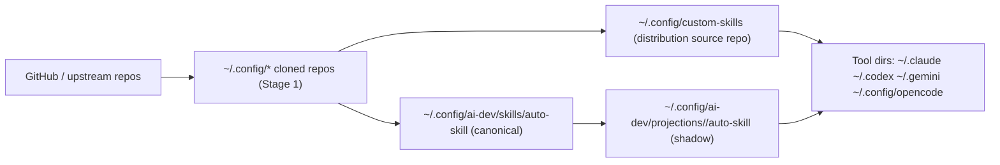
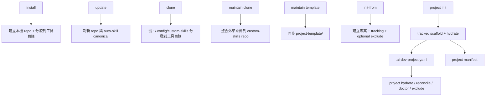

# ai-dev 指令與資料流參考

本文件描述 `ai-dev` 目前已實作的命令面、核心副作用、狀態檔與主要資料流。

目標讀者：
- 使用 `ai-dev` 的一般使用者
- 維護 `custom-skills` repo 的開發者
- 需要判斷某個指令會改哪些檔案、讀哪些 state 的人

本文描述的是「目前實作行為」，不是規劃稿。CLI 細節選項仍以 `ai-dev --help` 與各子命令 `--help` 為準。

## 命令分層

| 分類 | 命令 | 作用 |
|------|------|------|
| 環境安裝與分發 | `install`, `update`, `clone`, `status`, `list`, `toggle` | 安裝工具、更新倉庫、分發資源、檢查與切換資源狀態 |
| Repo 註冊 | `add-repo`, `add-custom-repo`, `update-custom-repo` | 管理上游 repo 與自訂 repo |
| 專案模板與投影 | `init-from`, `project init`, `project hydrate`, `project reconcile`, `project doctor`, `project update`, `project exclude` | 初始化專案、投影 AI 檔、檢查與維護專案內狀態 |
| custom-skills 自維護 | `maintain clone`, `maintain template` | 維護 `custom-skills` repo 本身 |
| 標準體系 | `standards status/list/switch/show/overlaps/sync` | 管理 `.standards/` profiles 與重疊檢測 |
| 同步與記憶 | `sync init/push/pull/status/add/remove`, `mem register/push/pull/status/cleanup/reindex/auto` | 跨裝置同步設定與 claude-mem 同步 |
| 輔助工具 | `test`, `coverage`, `derive-tests`, `hooks install/uninstall/status`, `tui` | 測試、覆蓋率、衍生測試、Hooks、互動介面 |

## 子命令速查

| 群組 | 子命令 |
|------|--------|
| `project` | `init`, `hydrate`, `reconcile`, `doctor`, `update`, `exclude` |
| `maintain` | `clone`, `template` |
| `standards` | `status`, `list`, `switch`, `show`, `overlaps`, `sync` |
| `hooks` | `install`, `uninstall`, `status` |
| `sync` | `init`, `push`, `pull`, `status`, `add`, `remove` |
| `mem` | `register`, `push`, `pull`, `status`, `cleanup`, `reindex`, `auto` |

## 重要狀態檔

| 路徑 | 用途 | 主要寫入者 |
|------|------|------------|
| `~/.config/custom-skills/` | 已安裝的 `custom-skills` 本機 repo，也是 Stage 3 分發來源 | `install`, `update` |
| `~/.config/custom-skills/disabled/` | 被停用後暫存的資源目錄 | `toggle`, `standards sync` |
| `~/.config/custom-skills/toggle-config.yaml` | toggle 資源開關狀態 | `toggle` |
| `<custom-skills repo>/upstream/sources.yaml` | 上游來源註冊表 | `add-repo`, repo 維護者手動維護 |
| `~/.config/ai-dev/repos.yaml` | custom repo / template repo 註冊表 | `add-custom-repo`, `init-from` |
| `~/.config/ai-dev/skills/auto-skill` | `auto-skill` canonical state | `install`, `update`, `clone`, `maintain clone` |
| `~/.config/ai-dev/projections/<target>/auto-skill` | 各 target 的 `auto-skill` shadow state | `install`, `clone` |
| `~/.config/ai-dev/manifests/projects/<project_id>.yaml` | 專案 AI projection manifest | `init-from`, `project init`, `project hydrate`, `project reconcile` |
| `<project>/.ai-dev-project.yaml` | 專案 intent、managed files、git exclude 設定 | `init-from`, `project init`, `project exclude`, `project hydrate` |
| `<project>/.git/info/exclude` | 本地 git 排除規則 | `init-from`, `project init`, `project hydrate`, `project reconcile`, `project exclude` |
| `<project>/openspec/project.md`、`<project>/openspec/config.yaml` | OpenSpec 專案初始化狀態 | 外部 `openspec init` |
| `<project>/.standards/manifest.json` | UDS scaffold manifest | `project init`, `init-from` |
| `<project>/.claude/disabled.yaml` | standards profile 停用清單 | `standards switch` |
| `<project>/.standards/active-profile.yaml` | 目前啟用的 standards profile | 外部 `uds init`, `standards switch` |
| `<project>/.standards/profiles/overlaps.yaml` | standards 重疊定義 | repo tracked scaffold / 模板內容 |
| `~/.config/ai-dev/sync.yaml` | sync 子系統設定 | `sync init`, `sync add`, `sync remove`, `sync push`, `sync pull` |
| `~/.config/ai-dev/sync-repo/` | sync 使用的本地 Git repo | `sync init`, `sync push`, `sync pull` |
| `~/.config/ai-dev/sync-server.yaml` | mem sync server 設定 | `mem register`, `mem auto` |
| `~/.config/ai-dev/pulled-hashes.txt` | mem pull 去重紀錄 | `mem pull` |
| `~/.claude-mem/claude-mem.db` | 本地 claude-mem SQLite 資料庫 | claude-mem worker / `mem pull` fallback import |
| `~/Library/LaunchAgents/com.ai-dev.mem-sync.plist` / user crontab | `mem auto` 安裝的排程設定 | `mem auto` |
| `project-template.manifest.yaml` | `project-template/` allowlist manifest | repo 維護者手動維護 |

## 核心資料流

### 1. 環境層：安裝、更新、分發

| 命令 | 主要副作用 |
|------|------------|
| `ai-dev install` | 預設依序執行 `tools → repos → state → targets`，建立工具環境、Clone repo、刷新 canonical state，最後分發到各工具目錄 |
| `ai-dev update` | 預設依序執行 `tools → repos → state`，更新工具與本機 repo，刷新 `auto-skill` canonical state，不直接動 target shadow |
| `ai-dev clone` | 預設依序執行 `state → targets`，先刷新 `auto-skill` canonical state，再從 `~/.config/custom-skills` 分發資源到各工具目錄並更新各 target shadow |
| `ai-dev status` | 讀取工具安裝狀態；對 repo 會比對 local HEAD 與 `origin/main`，若在 repo 內且存在上游同步紀錄，也會讀 `upstream/last-sync.yaml` / `upstream/sources.yaml` 顯示同步狀態 |
| `ai-dev list` | 讀取各 target 的資源清單與停用狀態，不寫入 state；`--target` 可省略，省略時等於列出所有 target，若無符合項目會顯示提示 |
| `ai-dev toggle` | 移動或還原 target 資源，並更新 `toggle-config.yaml`；`--target` 必填，支援 `--dry-run` 預覽 |

共享 phase 參數：
- `install`：允許 `tools,repos,state,targets`
- `update`：允許 `tools,repos,state`
- `clone`：允許 `state,targets`
- `--only <phase,...>`：只執行指定 phase
- `--skip <phase,...>`：從預設 phase 集合中移除指定 phase
- `--target <tool,...>`：限制 `targets` phase 的分發目標；目前只對 `install` / `clone` 有效
- `--dry-run`：只顯示執行計畫，不寫入任何檔案
- `clone` 額外保留 `--force`、`--skip-conflicts`、`--backup` 作為衝突處理策略

注意：
- `--only` 與 `--skip` 不能同時使用
- 若命令不支援某 phase，CLI 會以參數錯誤直接返回，不會噴 traceback

### Top-level 命令細部語意表

| 命令 | intent | side_effect_class | target_mode | 主要狀態寫入 |
|------|--------|-------------------|-------------|--------------|
| `ai-dev install` | 初始化或補齊全域 AI 開發環境 | `multi_stage_pipeline + system_level_operation` | `explicit_multi` | `~/.config/*`, `~/.config/ai-dev/skills/auto-skill`, `~/.config/ai-dev/projections/<target>/auto-skill` |
| `ai-dev update` | 刷新工具、repo 與 canonical state | `multi_stage_pipeline + system_level_operation` | `none` | `~/.config/*`, `~/.config/ai-dev/skills/auto-skill` |
| `ai-dev clone` | 將目前 state 套用到 targets | `multi_stage_pipeline` | `explicit_multi` | `~/.config/ai-dev/skills/auto-skill`, `~/.config/ai-dev/projections/<target>/auto-skill` |
| `ai-dev status` | 聚合顯示工具、repo、同步狀態 | `read_only` | `none` | 無 |
| `ai-dev list` | 列出 target 資源與停用狀態 | `read_only` | `implicit_default` | 無 |
| `ai-dev toggle` | 切換單一 target 上的單一資源啟用狀態 | `single_write` | `explicit_single` | `~/.config/custom-skills/disabled/`, `~/.config/custom-skills/toggle-config.yaml` |
| `ai-dev init-from` | 以外部模板 repo 初始化或更新專案 | `multi_stage_pipeline` | `none` | `~/.config/ai-dev/repos.yaml`, `<project>/.ai-dev-project.yaml`, `<project>/.git/info/exclude` |

### `ai-dev status`

- 支援 `--section tools|repos|sync`
- `tools` 會顯示核心工具與全域 NPM 套件
- `repos` 會顯示設定儲存庫狀態
- `sync` 會顯示上游同步狀態

### `ai-dev list`

- `--target` 可省略；未指定時代表所有 targets
- `--type` 可過濾 `skills / commands / agents / workflows`
- 若沒有符合結果，會顯示 `無符合結果`

### `ai-dev toggle`

- `--target`、`--type`、`--name` 為寫入前必要資訊
- `--enable` 與 `--disable` 二擇一
- `--dry-run` 只預覽，不移動或還原實體資源

### `ai-dev init-from`

- `ai-dev init-from <source>`：首次初始化專案
- `ai-dev init-from update`：更新既有 init-from 專案
- 舊的 `--update` 已移除，明確改為 `ai-dev init-from update`

### 2. 專案層：built-in project-template

`project init` 採用兩段式流程：

1. 複製 tracked scaffold。
2. 執行 hydrate projection，把 AI 管理檔案投影到專案內。

其中：
- tracked scaffold 例如 `.standards/`、`.editorconfig`、`.gitattributes`、`.gitignore`
- AI projection 例如 `.claude/`、`.codex/`、`.gemini/`、`.opencode/`、`AGENTS.md`、`CLAUDE.md`

AI projection 依型態再分三類：
- `managed_block`：`AGENTS.md`、`CLAUDE.md`、`GEMINI.md`、`INSTRUCTIONS.md`。只在檔案最上方插入或更新 ai-dev 管理區塊，檔案其他內容保留。
- `dir`：`.claude/`、`.codex/`、`.gemini/`、`.opencode/`、`.agent/`、`.agents/`、`.github/skills/`、`.github/prompts/` 等投影目錄。
- `file`：例如 `.github/copilot-instructions.md` 這類單檔投影。

### 3. 專案層：外部模板 repo

`init-from` 的語意是：
- `ai-dev init-from <source>`：從外部模板 repo 初始化專案
- `ai-dev init-from update`：從既有 `.ai-dev-project.yaml` 拉取並重新合併模板
- 建立或更新 `.ai-dev-project.yaml`
- 若目標已是 git repo，才詢問是否啟用 `.git/info/exclude`
- 若目標尚未 `git init`，略過詢問，也不會寫入 `git_exclude` 設定

`project init` 的語意是：
- 從內建 `project-template/` 初始化專案
- 同樣在 git repo 內詢問是否啟用 `.git/info/exclude`

這兩條路現在在「是否啟用本地排除」上應保持一致。

## `project` 子系統詳細行為

| 子命令 | 實際語意 | 主要副作用 / 備註 |
|--------|----------|-------------------|
| `project init` | 用內建 `project-template/` 初始化專案。先複製 tracked scaffold，再 hydrate AI projection。 | 同名檔案走內容分析；`--force` 直接覆蓋檔案並備份差異檔；同名目錄遞迴到檔案層級處理，不整個刪除重建。 |
| `project hydrate` | 依 `.ai-dev-project.yaml` 與模板重新生成 AI 管理檔。 | 會更新 projection manifest，並依 `git_exclude.enabled` 決定是否同步 `.git/info/exclude`。 |
| `project reconcile` | 重新比對 project intent、projection manifest 與實際投影結果後收斂。 | 目前底層仍走 projection/reconcile 流程；`--force` / `--backup` 只影響衝突處理模式。 |
| `project doctor` | 檢查 tracking file、projection manifest 與 exclude 狀態是否一致。 | 若缺少 `.ai-dev-project.yaml`、manifest，或應存在的 exclude block 不在 `.git/info/exclude`，會以非零碼退出。 |
| `project update` | 代理執行 `uds update` 與 `openspec update`。 | 先檢查工具是否已安裝與已初始化；若全部未初始化直接失敗，若只有部分未初始化則跳過未初始化工具。 |
| `project exclude` | 手動檢視、啟用或停用 ai-dev 管理的 `.git/info/exclude` 區塊。 | `--list` 可直接看目前 block；`--enable` 需已 `git init`，並會從 tracking/template 推導 patterns。 |

### `ai-dev project init`

作用：
- 建立 `.ai-dev-project.yaml`
- 複製 tracked scaffold
- 將 AI 管理檔交給 hydrate 投影

注意：
- `project init` 會放入 `.standards/` scaffold，但不會替外部 `uds` CLI 完成 `uds init`

衝突規則：
- 同名檔案：`init` 走內容級別分析；`init --force` 直接覆蓋檔案
- 同名目錄：遞迴到檔案層級處理；模板有對應檔案才比對與處理，目標額外檔案保留
- AI 管理檔：不在第一段直接 copy，而交給 hydrate

git exclude 規則：
- 若目標目錄已有 `.git/`，會詢問是否把 AI 生成檔加入 `.git/info/exclude`
- 若使用者選擇 `yes`，`git_exclude.enabled=true`
- 若使用者選擇 `no`，只記錄設定，不寫 `.git/info/exclude`
- 若目標目錄尚未 `git init`，只顯示提示，並將 `git_exclude.enabled=false`

### `ai-dev project hydrate`

作用：
- 依 `.ai-dev-project.yaml` 與 `project-template/` 重新生成 AI 管理檔
- 更新專案 projection manifest

exclude 規則：
- 若 `.ai-dev-project.yaml` 已有 `git_exclude` 設定，依 `enabled` 決定是否同步 `.git/info/exclude`
- 若 tracking file 尚未記錄 `git_exclude`，會先依目前 `.git/info/exclude` 的 ai-dev 管理區塊推導 `enabled` 狀態並補回 tracking config
- 補齊設定後，若 `enabled=false`，不會偷偷幫使用者開啟本地排除

### `ai-dev project reconcile`

目前實作等同重新執行 `hydrate_project()`，但語意上偏向：
- 比對 intent
- 比對 projection manifest
- 比對實際投影結果
- 依 `skip/force/backup` 收斂

### `ai-dev project doctor`

檢查三件事：
- `.ai-dev-project.yaml` 是否存在
- project projection manifest 是否存在
- 若 `git_exclude.enabled=true`，`.git/info/exclude` 是否存在 ai-dev 管理區塊

### `ai-dev project update`

用途：
- 代理執行 `uds update` 與 `openspec update`
- 可用 `--only uds` 或 `--only openspec` 限縮範圍

初始化檢查規則：
- 若 `uds` 尚未初始化（例如缺少 `.standards/manifest.json`、`.standards/active-profile.yaml`，或 manifest 結構無效），提示執行 `uds init`
- 若 `openspec` 尚未初始化（例如缺少 `openspec/project.md`、`openspec/config.yaml`，或 config 結構無效），提示執行 `openspec init`
- 若部分工具未初始化，只更新已初始化的工具

### `ai-dev project exclude`

用途：
- `--list`：列出目前 `.git/info/exclude` 管理區塊
- `--enable`：啟用本地排除並更新 tracking config
- `--disable`：移除 ai-dev 管理區塊並把 tracking config 標記為停用

注意：
- `--enable` 需要專案已是 git repo
- 這個命令是「手動補寫或切換 exclude 狀態」的正式入口

## `maintain` 子系統

這一組命令只給 `custom-skills` repo 維護者使用，不應混入一般使用者的 `install` / `clone` / `project init` 流程。

| 子命令 | 實際語意 | 主要副作用 / 備註 |
|--------|----------|-------------------|
| `maintain clone` | 把外部來源整合回目前的 `custom-skills` 開發目錄。 | 會把 UDS/Obsidian/Anthropic 等來源複製回 repo 工作樹，並刷新 `auto-skill` canonical state。 |
| `maintain template` | 依 `project-template.manifest.yaml` allowlist 同步 `project-template/`。 | `--check` 只檢查差異，不寫檔；不再透過 `project init --force` 反向同步模板。 |

### `ai-dev maintain clone`

作用：
- 整合外部來源回 `custom-skills` 開發目錄
- 取代過去把 repo 自維護邏輯混在 `clone` 裡的特殊分支

### `ai-dev maintain template`

作用：
- 依 `project-template.manifest.yaml` allowlist 同步 `project-template/`

設計原則：
- `project-template/` 不是靠 `project init --force` 反向同步
- 權威來源是 manifest + repo 內容

## `standards` 子系統

| 子命令 | 實際語意 | 主要副作用 / 備註 |
|--------|----------|-------------------|
| `standards status` | 顯示目前啟用的 profile 與 disabled 統計。 | 未初始化時只提示，不寫入。 |
| `standards list` | 列出可用 profiles、顯示名稱、重疊偏好與目前啟用狀態。 | 讀取 `.standards/profiles/*.yaml`；未初始化時只提示。 |
| `standards switch` | 切換 profile，重算 profile-based disabled 清單。 | 僅更新 `.claude/disabled.yaml` 與 `.standards/active-profile.yaml`；不再自動同步任何 target。 |
| `standards show` | 顯示單一 profile 的詳細內容與 overlap 選擇。 | 純讀取，不寫入。 |
| `standards overlaps` | 顯示 `overlaps.yaml` 摘要。 | 純讀取，不寫入。 |
| `standards sync` | 依 `disabled.yaml` 對指定 target 實際停用/還原 skills、commands、agents。 | `--target` 必填；`standards (*.ai.yaml)` 不會被此命令搬移。 |

主要狀態：
- `.standards/active-profile.yaml`：目前啟用的 profile
- `.claude/disabled.yaml`：依 overlap 計算出的停用清單
- `.standards/profiles/overlaps.yaml`：功能重疊定義

資料流：
1. `standards switch` 讀取 profile 與 overlaps 定義。
2. 依 profile 計算需要停用的資源，更新 `.claude/disabled.yaml` 與 `.standards/active-profile.yaml`。
3. `standards sync` 只會對顯式指定的 target 同步 disabled 清單到 `~/.config/custom-skills/disabled/` 與工具目錄。

注意：
- `standards (*.ai.yaml)` 本身是專案內 tracked 檔案，不會被 `standards sync` 自動搬移。
- `overlaps.yaml` 是規則來源，不是 CLI 執行期動態產物。

## `sync` 子系統

| 子命令 | 實際語意 | 主要副作用 / 備註 |
|--------|----------|-------------------|
| `sync init` | 初始化 `sync-repo/` 與 `sync.yaml`，並建立預設同步目錄。 | 首次初始化需顯式指定 `--mode bootstrap`；若 remote 已有內容，會先 repo→local 還原，再 local→repo 回寫；會寫 `.gitignore`、LFS 設定、plugin manifest，最後直接 push。 |
| `sync push` | 把本機同步目錄內容送進 `sync-repo/` 並推到 remote。 | 會正規化路徑、重寫 plugin manifest；無變更時直接返回，不更新 `last_sync`。 |
| `sync pull` | 從 remote 拉回 `sync-repo/`，再同步到本機目錄。 | 若偵測到本機未推送變更，會先提示使用者選擇；`--no-delete` 可保留本機多餘檔案。 |
| `sync status` | 顯示各同步目錄的本機差異數、遠端落後情況與最後同步時間。 | 純讀取，不寫入。 |
| `sync add` | 新增一個本機目錄到同步清單。 | 會更新 `sync.yaml`、建立對應 repo 子目錄並重寫 `.gitignore`，但不會自動 push。 |
| `sync remove` | 從同步清單移除一個目錄。 | 至少保留一個同步目錄；可選擇連同 repo 子目錄一起刪除，但不會自動 push。 |

主要狀態：
- `~/.config/ai-dev/sync.yaml`：同步目錄清單、remote、ignore profile、最後同步時間
- `~/.config/ai-dev/sync-repo/`：實際 Git backend repo

資料流：
1. `sync init --mode bootstrap` 建立或 clone `sync-repo/`，初始化 `sync.yaml`。
2. `sync push` 由本地目錄同步到 `sync-repo/`，提交並推送 remote；只有實際成功 push 時才更新 `last_sync`，無變更的 no-op push 不更新。
3. `sync pull` 從 `sync-repo/` 拉回本地目錄，依設定決定是否刪除本地多餘檔案；成功 pull 後更新 `last_sync`。
4. `sync add/remove` 修改 `sync.yaml` 的目錄清單。

## `mem` 子系統

| 子命令 | 實際語意 | 主要副作用 / 備註 |
|--------|----------|-------------------|
| `mem register` | 向 sync server 註冊目前裝置。 | 會寫入 `sync-server.yaml` 中的 `api_key`、`device_id`、最後 push/pull epoch 與 auto-sync 設定。 |
| `mem push` | 將本地 `claude-mem.db` 的新資料推到 sync server。 | 會先做 observations 去重與 preflight；只有真的推送成功才更新 `last_push_epoch`。 |
| `mem pull` | 從 sync server 拉回其他裝置的新資料。 | 先做 hash 去重，再優先走本地 worker API 匯入，失敗時 fallback 寫 SQLite；成功後更新 `last_pull_epoch` 與 `pulled-hashes.txt`；`--reindex` / `--cleanup` 為顯式後處理。 |
| `mem status` | 顯示 server 端計數、本地 observations 數、重複數與 last push/pull epoch。 | 純讀取，不寫入。 |
| `mem cleanup` | 清除本地 `claude-mem.db` 內的重複 observations。 | 兩輪去重：content hash 與 text+project。 |
| `mem reindex` | 透過 claude-mem worker 補建 ChromaDB 搜尋索引。 | 需要 worker 在線；完成後會自動跑一次 duplicate cleanup。 |
| `mem auto` | 檢視或切換自動同步排程。 | 不帶參數時只顯示狀態；`--on/--off` 會更新 `sync-server.yaml` 並安裝/移除 launchd 或 cron；`--dry-run` 只預覽系統層排程變更。 |

主要狀態：
- `~/.config/ai-dev/sync-server.yaml`：server URL、API key、device id、最後 push/pull 時間、auto sync 設定
- `~/.config/ai-dev/pulled-hashes.txt`：已 pull observations 的 content hash
- `~/.claude-mem/claude-mem.db`：本地 claude-mem SQLite

資料流：
1. `mem register` 註冊裝置並寫入 `sync-server.yaml`。
2. `mem push` 讀取本地 `claude-mem.db`，送到 sync server；只有實際成功推送資料時才更新 `last_push_epoch`。
3. `mem pull` 從 sync server 拉取資料，匯入本地 DB，成功後追加 `pulled-hashes.txt` 並更新 `last_pull_epoch`；若需要補建索引或清除重複，使用 `--reindex` / `--cleanup` 顯式啟用。
4. `mem auto` 會同步更新 `sync-server.yaml`，並直接安裝或移除使用者層級的 launchd / cron 排程。

## `hooks` 子系統

| 子命令 | 實際語意 | 主要副作用 / 備註 |
|--------|----------|-------------------|
| `hooks install` | 安裝或更新 ECC Hooks Plugin。 | `--target` 必填，且目前僅支援 `claude`；實際目標是 `~/.claude/plugins/ecc-hooks/`。 |
| `hooks uninstall` | 移除 ECC Hooks Plugin。 | `--target` 必填，且目前僅支援 `claude`；會先要求確認；若未安裝則直接提示返回。 |
| `hooks status` | 顯示 ECC Hooks Plugin 安裝狀態。 | `--target` 必填，且目前僅支援 `claude`；純讀取，不寫入。 |

## 命令關聯圖

## 維護建議

- 若修改命令語意，先更新本文件，再更新 README 的摘要說明。
- 若新增狀態檔或 manifest，補到「重要狀態檔」表格。
- 若新增會跨層寫檔的命令，補到「核心資料流」與「命令關聯圖」。
- 若 README 與本文件不一致，以修正兩者為同一個提交的一部分。
