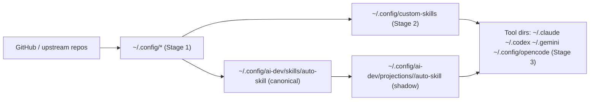
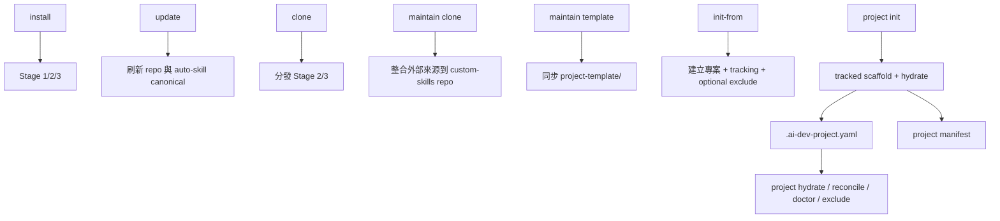

# ai-dev 指令與資料流參考

本文件描述 `ai-dev` 目前已實作的命令面、核心副作用、狀態檔與主要資料流。

目標讀者：
- 使用 `ai-dev` 的一般使用者
- 維護 `custom-skills` repo 的開發者
- 需要判斷某個指令會改哪些檔案、讀哪些 state 的人

本文描述的是「目前實作行為」，不是規劃稿。CLI 細節選項仍以 `ai-dev --help` 與各子命令 `--help` 為準。

## 命令分層

| 分類 | 命令 | 作用 |
|------|------|------|
| 環境安裝與分發 | `install`, `update`, `clone`, `status`, `list`, `toggle` | 安裝工具、更新倉庫、分發資源、檢查與切換資源狀態 |
| Repo 註冊 | `add-repo`, `add-custom-repo`, `update-custom-repo` | 管理上游 repo 與自訂 repo |
| 專案模板與投影 | `init-from`, `project init`, `project hydrate`, `project reconcile`, `project doctor`, `project update`, `project exclude` | 初始化專案、投影 AI 檔、檢查與維護專案內狀態 |
| custom-skills 自維護 | `maintain clone`, `maintain template` | 維護 `custom-skills` repo 本身 |
| 標準體系 | `standards status/list/switch/show/overlaps/sync` | 管理 `.standards/` profiles 與重疊檢測 |
| 同步與記憶 | `sync init/push/pull/status/add/remove`, `mem register/push/pull/status/cleanup/reindex/auto` | 跨裝置同步設定與 claude-mem 同步 |
| 輔助工具 | `test`, `coverage`, `derive-tests`, `hooks install/uninstall/status`, `tui` | 測試、覆蓋率、衍生測試、Hooks、互動介面 |

## 重要狀態檔

| 路徑 | 用途 | 主要寫入者 |
|------|------|------------|
| `~/.config/custom-skills/` | Stage 2 整合後的統一資源目錄 | `install`, `clone`, `maintain clone` |
| `~/.config/ai-dev/repos.yaml` | 上游 repo / custom repo 註冊表 | `add-repo`, `add-custom-repo`, `update-custom-repo` |
| `~/.config/ai-dev/skills/auto-skill` | `auto-skill` canonical state | `update`, `clone` |
| `~/.config/ai-dev/projections/<target>/auto-skill` | 各 target 的 `auto-skill` shadow state | `clone` |
| `~/.config/ai-dev/manifests/projects/<project_id>.yaml` | 專案 AI projection manifest | `project hydrate`, `project reconcile`, `project init` |
| `<project>/.ai-dev-project.yaml` | 專案 intent、managed files、git exclude 設定 | `init-from`, `project init`, `project exclude`, `project hydrate` |
| `<project>/.git/info/exclude` | 本地 git 排除規則 | `init-from`, `project init`, `project hydrate`, `project reconcile`, `project exclude` |
| `project-template.manifest.yaml` | `project-template/` allowlist manifest | `maintain template` |

## 核心資料流

### 1. 環境層：安裝、更新、分發

| 命令 | 主要副作用 |
|------|------------|
| `ai-dev install` | 建立或更新 Stage 1/2/3，初始化本機環境 |
| `ai-dev update` | 更新工具與 repo，刷新 `auto-skill` canonical state，不直接動 target shadow |
| `ai-dev clone` | 執行 Stage 2/3，分發資源並更新各 target 的 `auto-skill` shadow |

### 2. 專案層：built-in project-template

`project init` 採用兩段式流程：

1. 複製 tracked scaffold。
2. 執行 hydrate projection，把 AI 管理檔案投影到專案內。

其中：
- tracked scaffold 例如 `.standards/`、`.editorconfig`、`.gitattributes`、`.gitignore`
- AI projection 例如 `.claude/`、`.codex/`、`.gemini/`、`.opencode/`、`AGENTS.md`、`CLAUDE.md`

### 3. 專案層：外部模板 repo

`init-from` 的語意是：
- 從外部模板 repo 初始化專案
- 建立 `.ai-dev-project.yaml`
- 視使用者選擇決定是否啟用 `.git/info/exclude`

`project init` 的語意是：
- 從內建 `project-template/` 初始化專案
- 同樣在 git repo 內詢問是否啟用 `.git/info/exclude`

這兩條路現在在「是否啟用本地排除」上應保持一致。

## `project` 子系統詳細行為

### `ai-dev project init`

作用：
- 建立 `.ai-dev-project.yaml`
- 複製 tracked scaffold
- 將 AI 管理檔交給 hydrate 投影

衝突規則：
- 同名檔案：`init` 走內容級別分析；`init --force` 直接覆蓋檔案
- 同名目錄：遞迴到檔案層級處理，不整個刪目錄
- AI 管理檔：不在第一段直接 copy，而交給 hydrate

git exclude 規則：
- 若目標目錄已有 `.git/`，會詢問是否把 AI 生成檔加入 `.git/info/exclude`
- 若使用者選擇 `yes`，`git_exclude.enabled=true`
- 若使用者選擇 `no`，只記錄設定，不寫 `.git/info/exclude`
- 若目標目錄尚未 `git init`，只顯示提示，並將 `git_exclude.enabled=false`

### `ai-dev project hydrate`

作用：
- 依 `.ai-dev-project.yaml` 與 `project-template/` 重新生成 AI 管理檔
- 更新專案 projection manifest

exclude 規則：
- 只在 `.ai-dev-project.yaml` 的 `git_exclude.enabled=true` 時同步 `.git/info/exclude`
- 若 `enabled=false`，不會偷偷幫使用者開啟本地排除

### `ai-dev project reconcile`

目前實作等同重新執行 `hydrate_project()`，但語意上偏向：
- 比對 intent
- 比對 projection manifest
- 比對實際投影結果
- 依 `skip/force/backup` 收斂

### `ai-dev project doctor`

檢查三件事：
- `.ai-dev-project.yaml` 是否存在
- project projection manifest 是否存在
- 若 `git_exclude.enabled=true`，`.git/info/exclude` 是否存在 ai-dev 管理區塊

### `ai-dev project exclude`

用途：
- `--list`：列出目前 `.git/info/exclude` 管理區塊
- `--enable`：啟用本地排除並更新 tracking config
- `--disable`：移除 ai-dev 管理區塊並把 tracking config 標記為停用

注意：
- `--enable` 需要專案已是 git repo
- 這個命令是「手動補寫或切換 exclude 狀態」的正式入口

## `maintain` 子系統

這一組命令只給 `custom-skills` repo 維護者使用，不應混入一般使用者的 `install` / `clone` / `project init` 流程。

### `ai-dev maintain clone`

作用：
- 整合外部來源回 `custom-skills` 開發目錄
- 取代過去把 repo 自維護邏輯混在 `clone` 裡的特殊分支

### `ai-dev maintain template`

作用：
- 依 `project-template.manifest.yaml` allowlist 同步 `project-template/`

設計原則：
- `project-template/` 不是靠 `project init --force` 反向同步
- 權威來源是 manifest + repo 內容

## 命令關聯圖

## 維護建議

- 若修改命令語意，先更新本文件，再更新 README 的摘要說明。
- 若新增狀態檔或 manifest，補到「重要狀態檔」表格。
- 若新增會跨層寫檔的命令，補到「核心資料流」與「命令關聯圖」。
- 若 README 與本文件不一致，以修正兩者為同一個提交的一部分。
