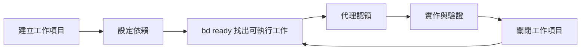
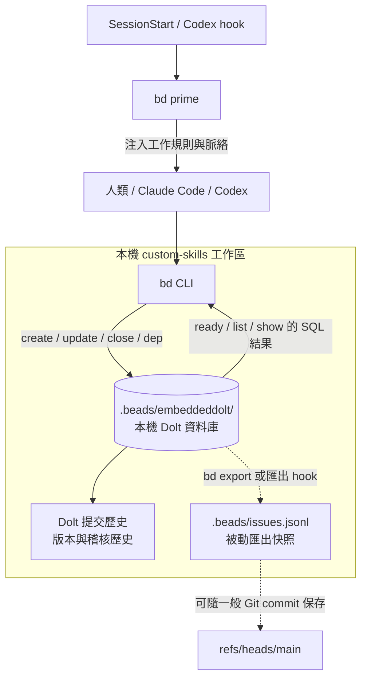
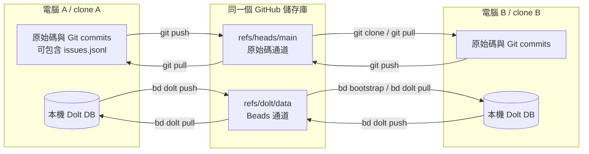

# Beads（bd）安裝、使用與 Claude/Codex 協作指南

> 本指南依據 Beads 官方文件與本專案的 `bd 1.1.0` 實測整理。查核日期：2026-07-16。

---

## 概述

[Beads](https://github.com/gastownhall/beads) 是為 AI 程式代理設計的分散式圖狀工作追蹤器。
它把任務、優先級、依賴關係、執行狀態與跨工作階段記憶，保存到具版本歷史的 [Dolt](https://www.dolthub.com/) 資料庫。

它主要解決以下問題：

- AI 對話壓縮、清除或切換工具後，工作狀態容易遺失。
- 多個代理可能重複處理同一件事。
- Markdown 待辦清單無法可靠表達阻擋關係與「現在可做的工作」。
- Claude Code、Codex 或不同電腦之間缺少共同的交接狀態。

典型生命週期如下：



Beads 不取代 Git：

| 資料 | 主要工具 | 用途 |
| --- | --- | --- |
| 原始碼與一般文件 | Git | 分支、commit、程式碼審查、版本發布 |
| 工作項目與依賴圖 | Beads / Dolt | 認領、阻擋、狀態、交接、稽核歷史 |
| `.beads/issues.jsonl` | Beads 匯出檔 | 檢視、交換與遷移；不是同步來源 |

## 核心概念

### 工作項目

每個工作項目都有雜湊式識別碼，例如 `custom-skills-b1c`。常用欄位如下：

| 欄位 | 說明 |
| --- | --- |
| `title` | 簡短、可辨識的工作名稱 |
| `description` | 背景、範圍與必要脈絡 |
| `acceptance` | 可驗證的完成條件 |
| `type` | `bug`、`feature`、`task`、`epic`、`chore`、`decision` |
| `priority` | `0` 到 `4`；`0` 最高，`4` 最低 |
| `status` | 常見為 `open`、`in_progress`、`blocked`、`closed` |
| `assignee` | 目前負責者 |
| `notes` | 執行進度、發現與交接資訊 |

### 依賴圖與 ready 狀態

`bd ready` 只列出狀態為 `open`、未延後且沒有未完成阻擋項目的工作。代理不必自行閱讀整份待辦清單來判斷執行順序。

以下指令表示「`custom-skills-test` 被 `custom-skills-feature` 阻擋」：

```bash
bd dep add custom-skills-test custom-skills-feature
```

第一個識別碼是被阻擋的工作，第二個識別碼是前置工作。也可以寫成較容易閱讀的形式：

```bash
bd dep add custom-skills-test --blocked-by custom-skills-feature
```

常見關係：

| 關係 | 用途 | 影響 `bd ready` |
| --- | --- | --- |
| `blocks` | 前置工作未完成前，不可開始後續工作 | 是 |
| `related` | 建立參考關聯，但不阻擋 | 否 |
| `parent-child` | Epic、工作與子工作的階層 | 否 |
| `discovered-from` | 記錄工作是在執行另一項工作時發現 | 否 |

### 儲存模式

Beads 以 Dolt 為儲存後端：

| 模式 | 初始化方式 | 特性 | 適用情境 |
| --- | --- | --- | --- |
| Embedded | `bd init` | 程序內執行；單一寫入者 | 一般專案 |
| Server | `bd init --server` | 外部服務；多個並行寫入者 | 高併發代理 |

Embedded 是預設模式，也適合 Claude Code 與 Codex 在同一個專案中輪流操作。若多個程序需要高頻率同時寫入，才考慮 Server 模式。

## Beads 如何運行

一句話來說：`bd` 是操作介面，Dolt 是本機的正式工作資料庫，JSONL 是可讀的匯出檔，
GitHub remote 則是需要明確 push／pull 才會更新的跨電腦交換點。

### 每個元件負責什麼

| 元件 | 實際用途 | 本機 `bd` 查詢是否以它為準 |
| --- | --- | --- |
| `bd` CLI | 建立、查詢、認領、更新與關閉工作 | 否；它是操作入口 |
| `.beads/embeddeddolt/` | 本機 Dolt 資料庫，保存工作欄位、依賴與版本歷史 | 是；本機 `bd` 指令以此為準 |
| `.beads/config.yaml` | 專案設定與 Dolt remote 位址 | 否；不保存工作內容 |
| `.beads/issues.jsonl` | 供檢視、交換、遷移與 Git diff 使用的匯出快照 | 否；不能取代 Dolt 同步 |
| `refs/dolt/data` | Dolt 遠端歷史與同步通道 | 否；需先 pull／bootstrap 到本機 Dolt |
| Claude／Codex hooks | 在工作階段開始時執行或提示 `bd prime` | 否；不會自動同步遠端 |

### 單機讀寫資料流

本專案使用 Embedded 模式。Dolt 引擎包含在 `bd` 程序內，不需要另外啟動資料庫服務：



指令實際發生的事情：

1. `bd ready`、`bd list`、`bd show` 直接查詢本機 Dolt，不會連線到 GitHub，也不會先自動 pull。
2. `bd create`、`bd update`、`bd close` 與 `bd dep add` 直接修改本機 Dolt；
   Embedded 模式會保留 Dolt 版本歷史。
3. `bd update <id> --claim` 在資料庫內一次完成負責者與狀態更新，避免兩個代理分開更新欄位造成重複認領。
4. `bd export` 或相關 hook 可以刷新 `.beads/issues.jsonl`，但後續查詢仍以 Dolt 資料庫為準。
5. 只有執行 `bd dolt push`，本機工作資料才會離開這台電腦並更新 Dolt remote。

因此，Claude Code 與 Codex 在同一個工作區輪流操作時，會立即看到彼此寫入的 Dolt 狀態；
如果它們位於不同 clone 或不同電腦，則必須透過 `bd dolt push`／`bd dolt pull` 交換資料。

Server 模式只改變圖中央的儲存位置：多個 `bd` 客戶端會連到同一個 `dolt sql-server`，
因此可同時寫入。工作欄位、依賴圖、JSONL 匯出與 Dolt remote 的角色不變。

## 安裝

Beads CLI 是系統層級工具。不要把 Beads 的 GitHub 儲存庫 clone 到專案中；專案內的 `.beads/` 只保存該專案的設定與工作資料。

### macOS / Linux：Homebrew（建議）

```bash
brew install beads
```

更新：

```bash
brew upgrade beads
```

### Node.js 環境：npm

```bash
npm install -g @beads/bd
```

更新：

```bash
npm update -g @beads/bd
```

### macOS / Linux / FreeBSD：官方安裝腳本

```bash
curl -fsSL \
  https://raw.githubusercontent.com/gastownhall/beads/main/scripts/install.sh \
  | bash
```

官方腳本會依平台下載發行檔並驗證檢查碼。若是手動下載二進位檔，應自行比對發行頁中的 `checksums.txt`。

### Windows 11：PowerShell

```powershell
irm https://raw.githubusercontent.com/gastownhall/beads/main/install.ps1 | iex
```

### 驗證安裝

```bash
bd version
bd help
```

## 初始化專案

### 一般專案

在 Git 儲存庫根目錄執行：

```bash
bd init
```

`bd init` 預設會：

- 建立 `.beads/` 與 Embedded Dolt 資料庫。
- 依目錄名稱產生工作項目前綴。
- 偵測 Git `origin`，並在可用時建立 Dolt remote。
- 安裝 Git hooks。
- 建立或更新代理操作說明，並安裝專案層級的 Claude/Codex 整合。

指定前綴：

```bash
bd init --prefix api
```

只想個人使用、不把 Beads 檔案提交到共享專案：

```bash
bd init --stealth
```

### 既有 clone 或新電腦

若遠端已經有 Beads Dolt 歷史，使用：

```bash
bd bootstrap
```

它會偵測 `sync.remote`、Git `refs/dolt/data`、備份或 JSONL，採取不刪除既有工作項目的初始化方式。先預覽可執行：

```bash
bd bootstrap --dry-run
```

### 初始化後檢查

```bash
bd where
bd info
bd hooks list
bd dolt remote list
```

`bd where` 對 worktree 特別重要。它會顯示目前實際使用的 `.beads` 位置，避免代理寫到錯誤的工作區。

官方也建議使用 `bd doctor`。但本專案的 `bd 1.1.0` 在 Embedded 模式尚未支援該檢查，
因此需改用本節指令，加上 `bd lint` 與 `bd dep cycles` 完成檢查。

## 快速開始

以下流程涵蓋一項工作的完整生命週期。

### 1. 載入專案工作脈絡

```bash
bd prime
```

`bd prime` 會輸出目前工作流程、常用指令、專案狀態與持久記憶。Claude Code 與新版 Codex 可透過 hook 在工作階段開始時自動執行。

### 2. 建立工作項目

```bash
bd create \
  --title="修正登入逾時" \
  --description="登入權杖過期後，前端未導向登入頁。" \
  --type=bug \
  --priority=1 \
  --acceptance="加入重現測試；權杖過期時導向登入頁；相關測試通過"
```

建立後若要供腳本解析，加入 `--json`：

```bash
bd create "修正登入逾時" --type=bug --priority=1 --json
```

### 3. 找出並檢查可執行工作

```bash
bd ready
bd show <id>
```

不要只看標題就開始修改。先確認描述、驗收標準、依賴、備註與既有執行狀態。

### 4. 原子認領

```bash
bd update <id> --claim
```

`--claim` 會同時設定負責者與 `in_progress` 狀態。多個代理同時挑選工作時，這可降低重複實作的風險。

### 5. 記錄進度與發現

```bash
bd update <id> --append-notes="已重現問題；根因位於權杖更新失敗分支。"
```

若執行中發現另一項工作，建立新項目並保留來源關係：

```bash
new_id=$(bd create "補上權杖更新失敗的監控" --type=task --silent)
bd dep add "$new_id" <current-id> --type=discovered-from
```

若新工作會阻擋目前工作：

```bash
bd dep add <current-id> <blocker-id>
```

### 6. 驗證並關閉

先執行專案要求的測試、lint 或 build，再關閉工作項目：

```bash
bd close <id> --reason="已修正並通過相關測試"
```

查看因關閉而解除阻擋的工作：

```bash
bd close <id> --reason="已完成" --suggest-next
```

## 常用指令

### 查詢

```bash
bd ready                         # 無未完成阻擋項目的 open 工作
bd list --status=open            # 所有 open 工作
bd list --status=in_progress     # 執行中的工作
bd show <id>                     # 詳細資料、依賴與稽核歷史
bd blocked                       # 被阻擋的工作
bd search "登入"                # 依文字搜尋
bd stats                         # 專案統計
```

### 更新

```bash
bd update <id> --claim
bd update <id> --priority 0
bd update <id> --assignee alice
bd update <id> --append-notes="交接資訊"
bd update <id> --status blocked
```

AI 代理不要使用 `bd edit`。它會開啟互動式編輯器，容易讓自動流程停住；改用 `bd update` 的欄位旗標。

### 階層與依賴

```bash
epic_id=$(bd create "登入系統改善" --type=epic --silent)
bd create "修正權杖更新" --type=task --parent="$epic_id"

bd dep add <blocked-id> <blocker-id>
bd dep add <left-id> <right-id> --type=related
bd dep tree <id>
bd dep cycles
```

### 持久記憶

跨工作階段仍需保留、但不屬於單一工作進度的專案知識，可記錄成記憶：

```bash
bd remember "驗證流程必須先執行單元測試，再執行整合測試" --key test-order
bd memories test
```

使用原則：

- 可執行工作、缺陷與後續事項：建立工作項目。
- 單一工作的進度與交接：寫入該工作的 `notes`。
- 跨工作階段都適用的穩定知識：使用 `bd remember`。
- 不要另外建立 Markdown TODO 清單或 `MEMORY.md` 當成第二份真實來源。

## Claude Code 與 Codex 整合

### 安裝兩套整合

兩者可以同時安裝，不會互斥：

```bash
bd setup claude
bd setup codex
```

安裝後重新啟動 Claude Code 與 Codex，再檢查：

```bash
bd setup claude --check
bd setup codex --check
```

整合內容：

| 工具 | 安裝內容 | 工作階段行為 |
| --- | --- | --- |
| Claude Code | `.claude/settings.json`、`CLAUDE.md` | `SessionStart` 注入脈絡 |
| Codex | Beads 技能、`AGENTS.md`、`.codex/` hooks | 技能與原生 hook 注入脈絡 |

Codex 0.129.0 以上支援原生 `/hooks`。上下文壓縮後，Beads hook 會標記脈絡需要更新，並在下一個提示重新注入一次。

若工具沒有內建整合配方，可先查看支援清單，或輸出手動說明：

```bash
bd setup --list
bd onboard
```

### 共用工作狀態

Claude Code 與 Codex 都直接操作同一套 `bd` CLI 與同一個 Dolt 工作資料庫。交接時不需要把完整進度複製到聊天訊息。

建議流程：

1. 第一個代理執行 `bd ready`、`bd show <id>`、`bd update <id> --claim`。
2. 實作期間以 `bd update <id> --append-notes="..."` 記錄可恢復的進度。
3. 交接前記錄已完成、未完成、驗證結果與下一步。
4. 第二個代理先執行 `bd prime` 與 `bd show <id>`，確認工作仍為 `in_progress` 且交接對象正確。
5. 完成後執行品質檢查，再使用 `bd close`。

交接備註範例：

```bash
bd update <id> \
  --append-notes="交接給 Codex：已完成失敗測試；下一步修改 refreshToken。"
```

### 多代理並行原則

- 每個代理認領不同的 ready 工作。
- 認領前必須重新執行 `bd ready` 與 `bd show`，避免使用過期清單。
- 用 `blocks` 表達真正的執行順序；只需參考時使用 `related`。
- Embedded 模式只有一個寫入者。短暫、低頻的 CLI 操作可依序完成；需要多個代理高頻同時寫入時改用 Server 模式。
- Beads 負責工作協調，不會自動解決兩個代理同時修改相同原始碼的 Git 衝突。

## 跨電腦、clone 與 worktree

### ref 是什麼

Git 以 SHA 識別 commit 等物件；ref（reference）是指向某個 Git 物件的具名指標。
ref 可以移動到新的 SHA，讓人不必記住一長串雜湊值。

分支是 ref 的其中一種，但 ref 不一定是分支：

| Ref | 類型 | 用途 |
| --- | --- | --- |
| `refs/heads/main` | 分支 | `main` 目前指向的原始碼 commit |
| `refs/tags/v1.0.0` | 標籤 | 固定的版本位置 |
| `refs/remotes/origin/main` | 遠端追蹤 | 本機記錄的遠端 `main` 位置 |
| `refs/dolt/data` | 自訂 ref | Beads／Dolt 遠端資料歷史 |

簡化後，同一個 GitHub 儲存庫可以包含：

```text
ValorVie/custom-skills
├── refs/heads/main       # 一般原始碼分支
├── refs/tags/v1.0.0      # Git tag
└── refs/dolt/data        # Beads 使用的特殊資料 ref
```

所以「寫入不同 ref」不是把 Beads 建成 `main` 的子分支，而是讓兩個獨立指標
存在同一個 GitHub 儲存庫：

```text
git push      → 更新 refs/heads/main
bd dolt push  → 更新 refs/dolt/data
```

更新其中一個 ref 不會移動另一個，也不會自動把兩邊的內容合併。
`refs/dolt/data` 不屬於 `refs/heads/*`，因此不是 GitHub 一般分支列表中的分支。

#### 可見性不是權限邊界

網頁分支列表看不到自訂 ref，不代表資料是隱藏或私密的。Git 伺服器若公開該 ref，
具備儲存庫讀取權限的人可以列舉它：

```bash
git ls-remote origin
git ls-remote origin refs/dolt/data
```

- 公開儲存庫的 `refs/dolt/data` 應視為公開資料。
- 私有儲存庫只有具備儲存庫讀取權限的人能取得。
- ref 名稱不是密碼；不要在 Beads 工作內容或 `notes` 中保存機密。

GitHub REST API 也能列出儲存庫中的 refs，不限於分支與標籤。
詳見 [GitHub Git references API](https://docs.github.com/en/rest/git/refs)。

#### 一般 clone 不會取得所有 ref

一般 `git clone` 預設主要使用以下 refspec：

```text
+refs/heads/*:refs/remotes/origin/*
```

它會取得遠端分支，並自動取得與這些分支歷史相關的標籤；不會自動取得
`refs/dolt/*` 等任意自訂 ref。`git fetch --all` 的 `all` 是所有已設定的遠端，
不是遠端上的所有 ref。

Git 可以明確抓取自訂 ref：

```bash
git fetch origin \
  '+refs/dolt/data:refs/remotes/origin/dolt/data'
```

但這只是在一般 Git 儲存庫中保存一個 ref，不會建立可供 `bd ready` 查詢的
`.beads/embeddeddolt/`。Beads 新 clone 應執行 `bd bootstrap`；已有資料庫時使用
`bd dolt pull`。Git 的 refspec 細節可參考 [git-fetch 文件](https://git-scm.com/docs/git-fetch)，
clone 行為則見 [git-clone 文件](https://git-scm.com/docs/git-clone)。

### 兩條同步通道

原始碼與 Beads 可以使用同一個 GitHub 儲存庫，但會寫入不同 ref，兩者不會互相代替：

| 通道 | 指令 | GitHub 遠端 ref |
| --- | --- | --- |
| 原始碼 Git | `git pull` / `git push` | `refs/heads/*` |
| Beads Dolt | `bd dolt pull` / `bd dolt push` | `refs/dolt/data` |

- Git 通道以工作樹與 Git commit 為來源，不同步本機 Dolt 資料庫。
- Dolt 通道以 `.beads/embeddeddolt/` 為來源，不同步原始碼分支與 Git commit。

`.beads/issues.jsonl` 若已被 Git 追蹤，會跟著第一條通道進入 `refs/heads/main`；
但它仍只是匯出快照，不包含完整 Dolt 提交歷史、工作集與其他資料表。

### `bd dolt push` 會不會推到 GitHub

會，前提是 Dolt remote 指向 GitHub。本專案目前的設定是：

```text
origin  git+https://github.com/ValorVie/custom-skills.git
```

因此 `bd dolt push` 會在同一個 `ValorVie/custom-skills` GitHub 儲存庫建立或更新
`refs/dolt/data`。它不會：

- 修改 `main` 或其他 `refs/heads/*` 分支。
- 推送尚未提交的原始碼。
- 建立 GitHub Issues。
- 顯示成 GitHub 一般分支列表中的分支。

第一次成功執行 `bd dolt push` 時會發布 `refs/dolt/data`；之後的 push／pull 都以該 ref
交換 Dolt 歷史。GitHub 在這裡只是同時保存原始碼 ref 與 Dolt ref 的遠端儲存位置。

### 跨電腦資料流



同一個 GitHub 儲存庫不代表兩條通道會一起更新：

- 只執行 `git push`：GitHub 有最新原始碼，但 Beads 工作狀態可能仍只在本機。
- 只執行 `bd dolt push`：GitHub 有最新工作狀態，但原始碼 commit 可能尚未推送。
- 要讓另一台電腦完整接手：依權限分別同步 Git 與 Dolt 兩條通道。

同步工作資料：

```bash
bd dolt remote list
bd dolt pull
# 修改工作項目後
bd dolt push
```

確認 Dolt remote 與遠端 ref：

```bash
bd dolt remote list
git ls-remote origin refs/dolt/data
```

第二個指令有輸出 SHA，表示 GitHub 已存在 `refs/dolt/data`；沒有輸出通常表示尚未完成第一次
`bd dolt push`，也可能是目前帳號無法讀取該 remote。

第一次在新 clone 建立本機資料庫時，依序使用：

```bash
git clone https://github.com/ValorVie/custom-skills.git
cd custom-skills
bd bootstrap
bd ready
```

`git clone` 取得 `refs/heads/main` 的原始碼與已提交匯出檔；`bd bootstrap` 另外偵測
`refs/dolt/data`、複製 Dolt 歷史並設定後續 `bd dolt push`／`bd dolt pull` 使用的 remote。

重要限制：

- `git push` 不等於 `bd dolt push`。
- `bd dolt push` 不是 GitHub Issues API，也不會建立 GitHub issue。
- `bd ready` 與其他查詢預設只讀本機資料；跨電腦工作前要先判斷是否需要 `bd dolt pull`。
- `.beads/issues.jsonl` 不是跨機器同步來源。
- 不要用例行 `bd import .beads/issues.jsonl` 取代 `bd dolt pull`。JSONL 匯入無法推斷遠端已刪除或已整理的資料。
- `bd dolt push`、Git commit 與 `git push` 是否可由代理執行，仍以專案的代理權限規則為準。

### worktree 檢查

進入 worktree 後先執行：

```bash
bd where
```

確認 `database` 指向預期的工作區，再進行建立、認領或關閉操作。
不同 clone 或未共用 `.beads` 的 worktree，應透過 Dolt remote 同步，不要複製 Embedded Dolt 目錄。

## 如何協助開發流程

### 開始工作前

```bash
bd prime
bd dolt pull       # 跨 clone 工作時，且目前有同步權限
bd ready
bd show <id>
bd update <id> --claim
```

效益：代理取得最新規則與工作狀態，只挑選沒有阻擋的項目，並以原子操作防止重複認領。

### 實作期間

```bash
bd update <id> --append-notes="目前進度與驗證結果"
bd create "發現的後續工作" --type=task
bd dep add <new-id> <current-id> --type=discovered-from
```

效益：新發現不會消失在聊天記錄中，也不會擴大目前工作的範圍。

### 完成工作時

```bash
# 先執行專案品質檢查
bd close <id> --reason="完成內容與驗證摘要"
git status
```

效益：完成狀態會解除後續工作的阻擋，下一位代理可直接從 `bd ready` 繼續。

### 工作階段結束時

依專案權限執行以下檢查：

```bash
bd list --status=in_progress
bd blocked
git status
```

若可自行同步，才執行 `bd dolt push` 與 Git 推送；若採保守權限，回報建議指令並等待使用者授權。

## 本專案設定

截至 2026-07-16，本專案狀態如下：

| 項目 | 設定 |
| --- | --- |
| `bd` 版本 | `1.1.0` |
| 工作項目前綴 | `custom-skills` |
| 資料庫模式 | Embedded Dolt |
| 資料庫位置 | `.beads/embeddeddolt/` |
| Dolt remote | `origin` → `git+https://github.com/ValorVie/custom-skills.git` |
| JSONL 自動匯出 | 已啟用 |
| Git hooks | 五個標準 hooks 均已安裝 |
| Codex 整合 | 已安裝 |
| Claude Code 整合 | hooks 與 `CLAUDE.md` 管理區段已安裝，setup check 為 current |
| 代理權限 | `minimal`／保守模式；未經明確授權不自行 commit、push 或同步 Dolt remote |
| `bd doctor` | Embedded 模式尚未支援；目前只顯示提示 |

更新 Claude Code 管理區段：

```bash
bd setup claude
bd setup claude --check
```

更新後重新啟動 Claude Code，讓 `SessionStart` hook 生效。

## 疑難排解

| 問題 | 可能原因 | 處理方式 |
| --- | --- | --- |
| 找不到 `bd` | CLI 未安裝或 PATH 未更新 | 重裝後執行 `bd version` |
| 找不到專案資料庫 | 不在正確目錄，或新 clone 尚未初始化 | 執行 `bd where`；新 clone 執行 `bd bootstrap` |
| 資料庫鎖定 | Embedded 有其他寫入程序 | 等待完成；高併發改用 Server |
| 未自動取得脈絡 | hook 過期或工具未重啟 | 檢查 `bd prime`、`bd setup` 與 `bd info` |
| 整合顯示 `stale` | `bd` 更新後管理區段版本不一致 | 重新執行 `bd setup claude` 或 `bd setup codex` |
| 新電腦沒有工作項目 | 尚未取得 Dolt 歷史 | 執行 `bd bootstrap` 或 `bd dolt pull` |
| Git 與 Beads 狀態不同 | 兩者使用不同 ref | 另執行 `bd dolt pull` 或 `bd dolt push` |
| JSONL 與資料庫不同 | JSONL 尚未刷新 | 以 `bd list` 的 Dolt 資料為準 |
| worktree 資料庫錯誤 | 工作區解析錯誤 | 執行 `bd where` 確認 |

完整健康檢查：

```bash
bd version
bd where
bd info
bd lint
bd dep cycles
bd hooks list
bd setup claude --check
bd setup codex --check
bd dolt remote list
```

若使用的版本與儲存模式支援 `bd doctor`，再把它加入健康檢查。

## 更新與備份

小版本更新前後至少執行：

```bash
bd dolt pull
bd version
bd info --whats-new
bd hooks install
bd info
```

跨重大版本或資料庫 schema 遷移時，先閱讀官方升級指南。不要讓多個 clone 同時執行 schema 遷移。

需要可還原的完整 Dolt 備份時，使用 `bd backup`；不要把 JSONL 匯出視為完整資料庫備份：

```bash
bd backup init /path/to/backup
bd backup sync
bd backup status
```

## 相關資源

- [Beads 官方儲存庫](https://github.com/gastownhall/beads)
- [官方安裝指南](https://github.com/gastownhall/beads/blob/main/docs/getting-started/installation.md)
- [代理與 IDE 整合](https://github.com/gastownhall/beads/blob/main/docs/getting-started/ide-setup.md)
- [整體架構與讀寫路徑](https://github.com/gastownhall/beads/blob/main/docs/architecture/index.md)
- [同步概念](https://github.com/gastownhall/beads/blob/main/docs/core-concepts/sync-concepts.md)
- [Dolt 儲存架構](https://github.com/gastownhall/beads/blob/main/docs/architecture/dolt.md)
- [疑難排解](https://github.com/gastownhall/beads/blob/main/docs/reference/troubleshooting.md)
- [FAQ](https://github.com/gastownhall/beads/blob/main/docs/reference/faq.md)
